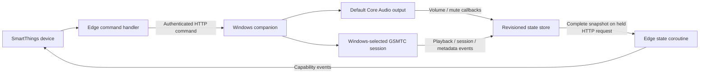

# Architecture and research

Research date: 2026-09-21. This architecture was presented before implementation.

## Decision

Use a C#/.NET Windows user-session agent and a Lua SmartThings Edge driver. A hub-initiated HTTP long poll delivers event notifications; a separate HTTP request sends commands. One standard-capability device represents the PC. Pairing is manual IPv4 plus a random token and stable companion UUID.

Following real backend validation, pairing uses 32 hex characters (16 random bytes / 128 bits). Embedded string preferences stay within 36 characters and have explicit, length-valid unpaired defaults. Lua rejects the zero IP, zero UUID and zero token independently before opening any connection. Windows rejects zero credentials too. Existing longer tokens are replaced with fresh secrets on an explicit migration or installer upgrade, with the companion UUID preserved.

## Research findings

| Source | Finding and consequence |
| --- | --- |
| [SmartThings LAN guide](https://developer.smartthings.com/docs/devices/hub-connected/lan) | Use `cosock` networking and asyncified LuaSocket HTTP. Edge callbacks share cooperative execution. Hub-side servers can bind only port 0; choosing an outbound connection avoids callback-port registration. |
| [Edge socket reference](https://developer.smartthings.com/docs/edge-device-drivers/socket.html) | TCP/UDP APIs exist within sandbox restrictions. No raw OS networking assumptions belong in driver code. |
| [Official Sonos profile](https://github.com/SmartThingsCommunity/SmartThingsEdgeDrivers/blob/main/drivers/SmartThings/sonos/profiles/sonos-player.yml), [event handlers](https://github.com/SmartThingsCommunity/SmartThingsEdgeDrivers/blob/main/drivers/SmartThings/sonos/src/api/event_handlers.lua), [command handlers](https://github.com/SmartThingsCommunity/SmartThingsEdgeDrivers/blob/main/drivers/SmartThings/sonos/src/api/cmd_handlers.lua) | Standard volume, mute, playback, track and track-data capabilities coexist on one main component. Profile config can restrict displayed playback commands. Inspected source, not just README. |
| [iquix Chromecast implementation](https://github.com/iquix/ST-Edge-Driver/blob/master/chromecast-audio/src/init.lua) | Inspected capability events, dedicated state coroutine, reconnect/backoff, and periodic status reconciliation. These are useful design patterns; Chromecast transport and child devices are not needed here. |
| [Google Cast Edge README](https://github.com/toddaustin07/googlecast) | Documents a companion bridge, manual configuration and presentation caveats. Its repository exposes documentation but not the full Edge implementation; it was not treated as inspected driver source. |
| [Core Audio callback](https://learn.microsoft.com/en-us/windows/win32/api/endpointvolume/nn-endpointvolume-iaudioendpointvolumecallback), [NAudio](https://github.com/naudio/NAudio/tree/v2.2.1) | Core Audio supplies endpoint volume/mute notifications. NAudio.Wasapi is a small established managed wrapper, avoiding a handwritten COM vtable. |
| [GSMTC manager](https://learn.microsoft.com/en-us/uwp/api/windows.media.control.globalsystemmediatransportcontrolssessionmanager), [GSMTC session](https://learn.microsoft.com/en-us/uwp/api/windows.media.control.globalsystemmediatransportcontrolssession) | Current-session selection, capability flags, Try commands, playback and metadata events are native Windows APIs. API baseline is Windows 10 1809. |
| [Windows interactive services](https://learn.microsoft.com/en-us/windows/win32/services/interactive-services) | Services run in Session 0. A per-user background app started with an interactive Task Scheduler token is the appropriate v1 lifecycle for user media. |
| [SmartThings preferences](https://developer.smartthings.com/docs/devices/preferences) | Embedded IP, port, identity and password-style token preferences survive driver restarts and trigger `infoChanged`. |

Research found established media-driver patterns; it does not establish that no other Windows integration exists. No world's-first claim is made. Inspected third-party code is not copied or vendored.

## Transport alternatives

| Option | Assessment |
| --- | --- |
| HTTP commands + long-held HTTP state request | Selected. Uses the documented HTTP client; native notifications complete the held request immediately. No hub listener or subscription address to persist. |
| UDP events | Small, but needs authentication/replay design, loss handling and callback-port renewal after hub restart. |
| WebSocket | Feasible (the Sonos repository contains a WebSocket stack), but adds framing, heartbeat and reconnect machinery beyond this milestone. Not assumed to be a turnkey Edge service. |
| Persistent TCP JSON | Viable future optimization; requires framing, partial-read handling and command correlation. |
| Short-interval polling | Simple but unnecessary traffic/latency when Windows already provides notifications. |

Long polling is event delivery, not an aggressive timer querying Windows. Each held request awaits a state-store signal and completes at a change or after 20 seconds. Native observers also reread Windows at 20-second intervals to recover missed events. About three unchanged snapshots per minute are expected.

## Windows design

- `AudioController` follows the default **render / multimedia** endpoint. A callback only wakes an observer, avoiding COM work or callback unregistration inside the native callback. Audio updates are coalesced for 60 ms. Device/default changes rebind the callback.
- `MediaController` uses `GetCurrentSession()` and observes session changes, playback and metadata. It does not infer a player from process names, launch applications, or send arbitrary keys. Unsupported commands return rejection. No selected session clears media state.
- Metadata reads are bounded and run independently of audio. Source resolves `SourceAppUserModelId` through Windows `AppInfo.DisplayInfo.DisplayName` on Windows 10 2004+; unresolved apps and older Windows retain the model ID. Resolution is cached for the current session. There is no player-specific friendly-name database. Text is capped at 256 Unicode scalar values.
- `StateStore` atomically updates immutable records and signals subscribers. Unchanged samples do not increment revisions. A per-process epoch distinguishes resets. Audio and media writers cannot overwrite each other's fields.
- ASP.NET Core's included Kestrel server provides bounded HTTP parsing and connection handling. The only non-platform runtime library is NAudio.Wasapi (plus NAudio.Core). A small Windows Forms tray interface uses the Windows Desktop runtime; there is no database or broker.
- An interactive limited-privilege scheduled task starts the console-free executable at sign-in. A separate STA thread owns the tray icon and pairing window, starting after HTTP startup succeeds. Closing the window leaves the host running; the tray Exit command requests graceful host shutdown. Identity is persisted in configuration; no state persists that could replay commands after restart.

## Edge design and capability mapping

| Capability | Command / observed state |
| --- | --- |
| `audioVolume` | `setVolume`, `volumeUp`, `volumeDown`; rounded Windows master volume |
| `audioMute` | `mute`, `unmute`, `setMute`; actual boolean mapped to muted/unmuted |
| `mediaPlayback` | `play`, `pause`; playing/paused/stopped; supportedPlaybackCommands |
| `mediaTrackControl` | `nextTrack`, `previousTrack`; native support checked at command execution |
| `audioTrackData` | title, artist, mediaSource; optional and cleared on session loss |
| `refresh` | Restart the state request loop |

No custom capabilities, power switch, manager device or child devices. Standard presentation is preferred over an exact handcrafted layout. The API exposes toggle for diagnostic/other local callers; the Edge device exposes explicit standard play and pause commands.

One coroutine per paired device receives snapshots; command handlers use the ordered device coroutine. Only the receiver applies state, avoiding command-response versus event-response races. Settings changes create a new generation; responses from the old generation are ignored. Duplicate/lower revisions within an epoch do not roll back state. A new epoch is accepted immediately.

Discovery creates one deterministic manual slot; a guard avoids simultaneous creates. Preferences, not a temporary Lua cache, hold pairing. Later discovery can use one UUID-based network ID per companion without changing the protocol. V1 is intentionally limited to one PC.

## Risks and outstanding validation

- Actual hub packaging, cooperative network behavior, app presentation and slider latency require hardware testing. Local Lua mocks cannot certify SmartThings behavior.
- SmartThings app/account setup still depends on its platform even though hub-to-PC control is local.
- App GSMTC support varies; unsupported next/previous and absent metadata are expected. A successful Try command is acceptance, not proof playback has already changed.
- Media calls may complete after timeout. Do not retry non-idempotent commands automatically.
- Sign-in is required; multi-user switching and service-before-login are outside v1.
- A changed PC/hub DHCP address requires manual settings/firewall updates. Use reservations.
- Tokens authenticate but HTTP does not encrypt. The threat model excludes hostile LAN observers; TLS/pinning would be a separate protocol upgrade.
- Endpoint removal marks the SmartThings device offline, retaining last known audio values. Media operation may still be available through the API.
- Reconnect delay tops out at 30 seconds, plus a possible socket timeout. Near-immediate updates are expected only while connected; no hard latency SLA is claimed.
